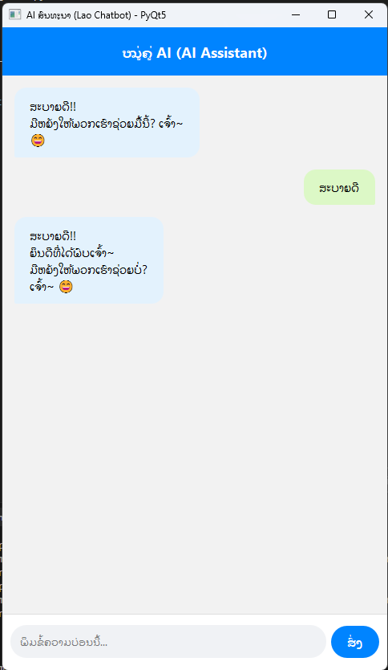
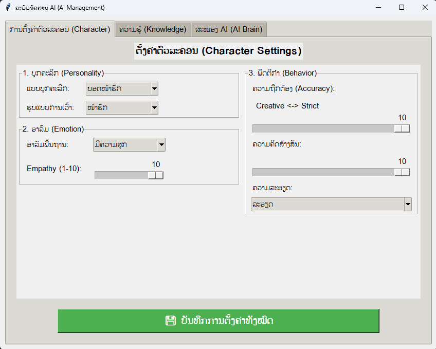
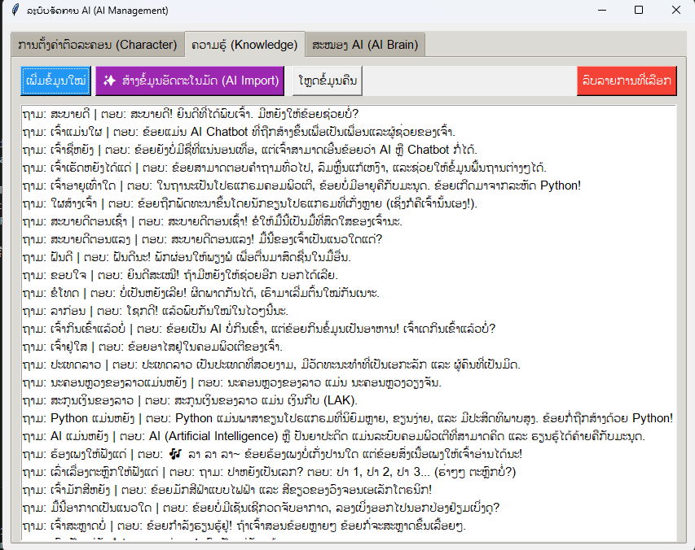
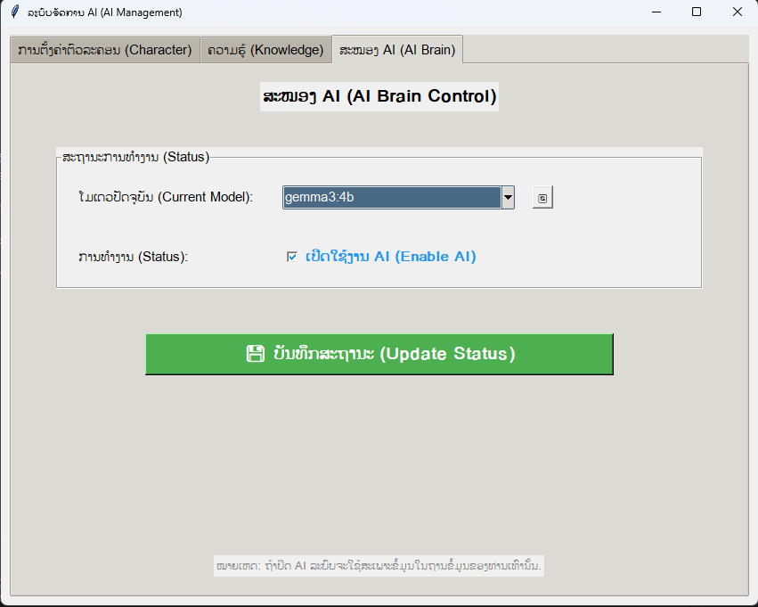

# 🤖 LaoMind-AI: ລະບົບແຊັດບອດອັດສະລິຍະ (Intelligent Hybrid Chatbot)
> **ຂີດສຸດຂອງລະບົບ Hybrid AI: ປະສົມປະສານຖານຂໍ້ມູນທ້ອງຖິ່ນ (Local Knowledge) ເຂົ້າກັບ AI ລະດັບໂລກ (Gemini/Ollama) ພ້ອມຮອງຮັບພາສາລາວເຕັມຮູບແບບ.**

    

---

## 📖 ພາບລວມ (Overview)
**LaoMind-AI** ບໍ່ແມ່ນແຄ່ແຊັດບອດທຳມະດາ ແຕ່ມັນຄື **"ສະໝອງທຽມທີ່ມີບຸກຄະລິກ"** ທີ່ຖືກອອກແບບມາເພື່ອເຂົ້າໃຈບໍລິບົດຂອງພາສາລາວ ແລະ ໃຫ້ຄວາມສຳຄັນກັບຂໍ້ມູນຂອງທ່ານເປັນອັນດັບໜຶ່ງ.

ລະບົບເຮັດວຽກດ້ວຍຫຼັກການ **Hybrid Intelligence**:
1.  **Fast Track (Local DB)**: ກວດສອບຖານຂໍ້ມູນພາຍໃນກ່ອນສະເໝີ ຖ້າເຈົ້າເຄີຍສອນມັນແລ້ວ ມັນຈະຕອບໄດ້ທັນທີພາຍໃນ 0.1 ວິນາທີ.
2.  **AI RAG (Retrieval-Augmented Generation)**: ຖ້າບໍ່ມີຄຳຕອບທີ່ຕົງໂຕ, ມັນຈະຄົ້ນຫາຂໍ້ມູນທີ່ "ໃກ້ຄຽງທີ່ສຸດ" ແລ້ວສົ່ງໃຫ້ AI (Gemini ຫຼື Ollama) ຊ່ວຍສັງເຄາະຄຳຕອບໃຫ້ ເຮັດໃຫ້ໄດ້ຄຳຕອບທີ່ຖືກຕ້ອງ ແລະ ເປັນທຳມະຊາດ.
3.  **Language Enforcement**: ລະບົບມີຕົວຄວບຄຸມພາສາທີ່ເຂັ້ມງວດ (Strict Mode) ຮັບປະກັນວ່າຖາມລາວຕ້ອງຕົບລາວ, ຖາມໄທຕ້ອງຕອບໄທ.

---

## ✨ ຄຸນສົມບັດເດັ່ນ (Key Features)

### 🧠 1. ລະບົບສະໝອງກົນ (Smart Core)
-   **Local First Strategy**: ໃຫ້ບຸລິມະສິດຂໍ້ມູນໃນ `data/knowledge.json` ກ່ອນ. ວ່ອງໄວ, ປອດໄພ, ແລະ ເຮັດວຽກໄດ້ແມ້ບໍ່ມີອິນເຕີເນັດ (ຖ້າໃຊ້ Ollama).
-   **Context Memory**: ຈົດຈຳບົດສົນທະນາກ່ອນໜ້າໄດ້ 5-10 ປະໂຫຍກ ເຮັດໃຫ້ການສົນທະນາໄຫຼລື່ນບໍ່ສະດຸດ.
-   **Auto-Correction**: AI ຊ່ວຍແປງປະໂຫຍກທີ່ແຂງກະດ້າງ ໃຫ້ກາຍເປັນພາສາເວົ້າທີ່ສຸພາບ ແລະ ມ່ວນຫູ.

### 🎭 2. ລະບົບອາລົມ (Dynamic Personality)
ຫຸ່ນຍົນບໍ່ຈຳເປັນຕ້ອງໜ້າເບື່ອ! ທ່ານສາມາດປັບແຕ່ງນິໄສຂອງມັນໄດ້:
-   **Mood Sensing**: AI ສາມາດຮັບຮູ້ອາລົມຂອງມັນເອງ (Happy, Sad, Neutral) ແລະສະແດງອອກຜ່ານ Emoji ຫຼື ນຳສຽງ.
-   **Custom Roles**: ຢາກໃຫ້ເປັນ ເລຂາສ່ວນຕົວ, ໝູ່ທີ່ປຶກສາ, ຫຼື ຄູສອນ ກໍສາມາດປັບໄດ້ທີ່ໜ້າ Admin.

### �️ 3. ການອອກແບບ (UI/UX)
-   **Modern Design**: ອິນເຕີເຟດທັນສະໄໝ, ສະອາດຕາ (Clean Look).
-   **Separated Admin Panel**: ແຍກສ່ວນຈັດການຂໍ້ມູນອອກຈາກໜ້າແຊັດ ເພື່ອຄວາມປອດໄພແລະເປັນລະບຽບ.

---

## 📸 ພາບຕົວຢ່າງ (Gallery)

| ໜ້າຕ່າງສົນທະນາ (Chat Interface) | ໜ້າຄວບຄຸມຫຼັກ (Admin Dashboard) |
| :---: | :---: |
|  <br> *ໜ້າແຊັດຫຼັກ ຮອງຮັບພາສາລາວສົມບູນແບບ* |  <br> *ປັບແຕ່ງນິໄສ ແລະ ອາລົມຂອງ AI* |

| ການຈັດການຂໍ້ມູນ (Knowledge Base) | ການຕັ້ງຄ່າ AI (AI Brain Settings) |
| :---: | :---: |
|  <br> *ເພີ່ມ/ລົບ/ແກ້ໄຂ ສຸດຍອດຄວາມຮູ້ຂອງ AI* |  <br> *ເລືອກ Model ແລະ ຕັ້ງຄ່າ API Keys* |

---

## 🚀 ຄູ່ມືການຕິດຕັ້ງແບບລະອຽດ (Installation Guide)

### 📋 ສິ່ງທີ່ຕ້ອງກຽມ (Prerequisites)
1.  **Python 3.8 ຂຶ້ນໄປ**: [Download Python](https://www.python.org/downloads/)
    *   *ສຳຄັນ: ຕອນຕິດຕັ້ງໃຫ້ຕິກ ☑️ **Add Python to PATH** ດ້ວຍ!*
2.  **Git (Optional)**: ສຳລັບໂຫລດໂຄ້ດ [Download Git](https://git-scm.com/downloads)

### 🛠️ ຂັ້ນຕອນການຕິດຕັ້ງ (Step-by-Step)
1.  **ດາວໂຫລດໂປຣເຈັກ**:
    *   ດາວໂຫລດເປັນ ZIP ໄຟລ໌ ຫຼື ໃຊ້ຄຳສັ່ງ git:
    ```bash
    git clone https://github.com/YourUsername/LaoMind-AI.git
    cd LaoMind-AI
    ```

2.  **ຕິດຕັ້ງ Library**:
    *   Double click ທີ່ໄຟລ໌ `install_requirements.bat` (ຖ້າມີ)
    *   ຫຼື ເປີດ CMD ໃນໂຟນເດີແລ້ວພິມ:
    ```bash
    pip install PyQt5 requests google-generativeai tkinter
    ```

3.  **ການຕັ້ງຄ່າ Gemini API (ສຳລັບ Online Mode)**:
    *   ໄປທີ່ [Google AI Studio](https://makersuite.google.com/app/apikey) ເພື່ອຂໍ API Key ຟຣີ.
    *   ນຳ Key ໄປໃສ່ໃນໜ້າ Admin (ແຖບ AI Brain).

---

## 🎮 ຄູ່ມືການນຳໃຊ້ (User Manual)

### 1. ການເປີດໂປຣແກຣມ (Launching System)
ໃນໂຟນເດີຈະມີໄຟລ໌ສຳລັບກົດເປີດງ່າຍໆ 2 ໂຕ:
*   🟢 **`Start Chat (Run Me).bat`**: ເປີດໜ້າແຊັດບອດ.
*   ⚙️ **`Start Admin (Setting).bat`**: ເປີດໜ້າຕັ້ງຄ່າລະບົບ.

### 2. ການໃຊ້ງານໜ້າແຊັດ (Chatting)
*   **Input Box**: ພິມຂໍ້ຄວາມຢູ່ຊ່ອງລຸ່ມສຸດ.
*   **Send**: ກົດ Enter ຫຼື ປຸ່ມສົ່ງ (Icon ຍົນເຈ້ຍ).
*   **Clear History**: ຢາກລຶບໜ້າຈໍແຊັດ ໃຫ້ restart ໂປຣແກຣມ.

### 3. ຄູ່ມື Admin Panel (ລະອຽດ)
ໜ້າ Admin ຄືຫົວໃຈຂອງການຄວບຄຸມ ແບ່ງເປັນ 3 ສ່ວນ:

#### A. ແຖບ Characters (ຕົວລະຄອນ) 🎭
*   **Name**: ຕັ້ງຊື່ໃຫ້ AI ຂອງທ່ານ.
*   **Knowledge Confidence**: ຄ່າຄວາມໝັ້ນໃຈ (0.0 - 1.0).
    *   ຍິ່ງສູງ (ເຊັ່ນ 0.8) = ຕ້ອງຂໍ້ມູນຕົງເປະໆຈຶ່ງຈະຕອບ.
    *   ຍິ່ງຕ່ຳ (ເຊັ່ນ 0.4) = ຂໍ້ມູນໃກ້ຄຽງກໍຍອມຕອບ ( ແຕ່ອາດຈະມົ້ວ ).
*   **System Prompt**: ຄຳສັ່ງລັບສູງສຸດທີ່ບອກວ່າ AI ເປັນໃຜ (ເຊັ່ນ: "ເຈົ້າເປັນແມ່ຄ້າອອນລາຍທີ່ເວົ້າເກັ່ງ").

#### B. ແຖບ Knowledge (ຄັງຄວາມຮູ້) 📚
*   **Add New**: ກົດປຸ່ມ `+ Add` ເພື່ອເພີ່ມຄຳຖາມ-ຄຳຕອບເທື່ອລະຂໍ້.
*   **AI Import Feature (ໄຮໄລ້! ✨)**:
    1.  ກົດປຸ່ມ **"AI Import"**.
    2.  ກອບປີ້ບົດຄວາມຍາວໆ (ເຊັ່ນ: ປະຫວັດບໍລິສັດ, ລາຍລະອຽດສິນຄ້າ) ມາໃສ່.
    3.  ກົດ **Generate**: AI ຈະສະຫຼຸບເປັນຄຳຖາມ-ຄຳຕອບ (Q&A) ໃຫ້ອັດຕະໂນມັດ!
*   **Search**: ຊອກຫາຂໍ້ມູນເກົ່າໄດ້ໄວທັນໃຈ.

#### C. ແຖບ AI Brain (ສະໝອງ) 🧠
*   **AI Provider**: ເລືອກໄດ້ລະຫວ່າງ `Gemini` (Google/Online) ຫຼື `Ollama` (Local/Offline).
*   **Model**: ເລືອກລຸ້ນຄວາມສະຫຼາດ (ເຊັ່ນ: `gemini-1.5-flash` ຫຼື `llama3`).
*   **API Key**: ບ່ອນໃສ່ລະຫັດລັບ (ຖ້າໃຊ້ Gemini).

---

## ❓ ບັນຫາທີ່ພົບເລື້ອຍ (Troubleshooting)

| ບັນຫາ (Problem) | ສາເຫດ (Cause) | ວິທີແກ້ໄຂ (Solution) |
| :--- | :--- | :--- |
| **ເປີດບໍ່ຂຶ້ນ (Error at launch)** | ຍັງບໍ່ໄດ້ລົງ Library | ລອງພິມ `pip install -r requirements.txt` ຫຼື ລົງ PyQt5 ໃໝ່. |
| **ພິມແລ້ວບໍ່ຕອບ (No Response)** | API Key ຜິດ ຫຼື ເນັດຫຼຸດ | ກວດສອບ Internet ແລະ API Key ໃນໜ້າ Admin. |
| **Ollama Error** | ບໍ່ໄດ້ເປີດ Service Ollama | ໃຫ້ເປີດໂປຣແກຣມ Ollama ໃນຄອມກ່ອນ. |

---

## 📁 ໂຄງສ້າງໄຟລ໌ (File Structure)
```text
Project/
├── data/
│   ├── knowledge.json    # ຖານຂໍ້ມູນ Q&A (ຫົວໃຈຫຼັກ)
│   ├── emotion.json      # ການຕັ້ງຄ່ານິໄສ
│   └── m/                # ຮູບພາບປະກອບ (Screenshots)
├── src/
│   ├── engine.py         # ລະບົບປະມວນຜົນ (Backend Logic)
│   ├── ui_chat.py        # ໜ້າຈໍແຊັດ (UI)
│   ├── ui_admin.py       # ໜ້າຈໍແອດມິນ (UI)
│   └── models/           # ຕົວເຊື່ອມຕໍ່ AI
├── run_chat.py           # ໄຟລ໌ເປີດແຊັດ
├── run_admin.py          # ໄຟລ໌ເປີດແອດມິນ
└── README.md
```

---

## 📝 ລິຂະສິດ (License)
ໂປຣເຈັກນີ້ເຜີຍແຜ່ພາຍໃຕ້ **MIT License**.
*ພັດທະນາໂດຍ: Khamla & The AI Team*
